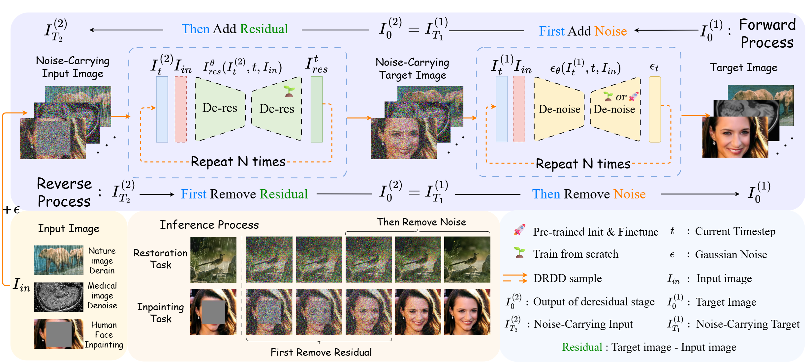
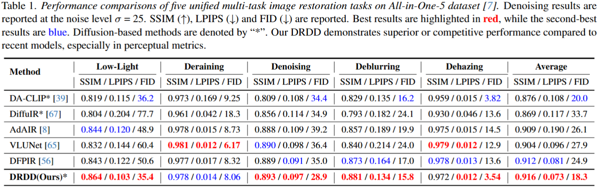

# Decoupled Residual Denoising Diffusion Models for Unified and Data Efficient Image-to-Image Translation

This repository contains the official inference code for the paper "Decoupled Residual Denoising Diffusion Models for Unified and Data Efficient Image-to-Image Translation". Full training details will be released upon acceptance.
<p align="center">

</p>

## Requirements

To install requirements:

```
conda env create -f install.yaml

apt install libopenmpi-dev openmpi-bin

conda activate drdd
```


## Test Dataset

[Rain100L](./dataset/Rain100L)

[GoPro](./dataset/GoPro)

[Dehaze](./dataset/dehaze.tar.gz)

[CBSD68](./dataset/denoise.tar.gz)

[LOL](./dataset/lol)

Place the datasets in the `./data` directory, following the folder structure below:

<pre>
/dataset
├── /denoise
│   ├── /CBSD68
│   └── make_noise_dataset.py
├── /Rain100L
│   ├── /input
│   └── /target
├── /dehaze
│   ├── /gt
│   ├── /haze
│   └── make_haze_flist.py
├── /GoPro
│   ├── /input
│   ├── /target
└── /lol
    ├── /high
    └── /low
</pre>

### Generating Datasets
To generate the denoising test dataset `CBSD68_test25`, run:
```
python ./dataset/denoise/make_noise_dataset.py
```
To generate the dehaze datasets `haze.flist` and `gt.flist`, run:
```
python ./dataset/dehaze/make_dehaze_flist.py
```

## Training

Training details will be released upon acceptance.

## Pre-trained Models

[The pre-trained models (in all-in-one-5 dataset)].

You can set the pre-trained model checkpoints in the `./ckpt` directory.


## Inference

To obtain the result of our DRDD in all-in-one-5 dataset, modify the `test.task` parameter in [`./config/AiO5_test.yaml`](./config/AiO5_test.yaml) and then run:

```eval
python test.py --data_config AiO5_test
```

The result will shows in `.\Experience_record`.

## Evaluation
To evaluate DRDD on the all-in-one-5 dataset, run:
```
# rain
python evaluation.py \
  --gt_dir ./dataset/Rain100L/target \
  --pred_dir ./Experience_record/aio5/rain/test/dataset/ \
  --calculate_lpips

# lol
python evaluation.py \
  --gt_dir ./dataset/lol/high \
  --pred_dir ./Experience_record/aio5/light/test/dataset/ \
  --calculate_lpips

# haze
python evaluation.py \
  --gt_dir ./dataset/dehaze/gt \
  --pred_dir ./Experience_record/aio5/haze/test/dataset \
  --calculate_lpips

# noise
python evaluation.py \
  --gt_dir ./dataset/denoise/CBSD68 \
  --pred_dir ./Experience_record/aio5/noise/test/dataset/ \
  --calculate_lpips

# blur
python evaluation.py \
  --gt_dir ./dataset/GoPro/target \
  --pred_dir ./Experience_record/aio5/blur/test/dataset/ \
  --calculate_lpips
```
## Results

<p align="center">

</p>