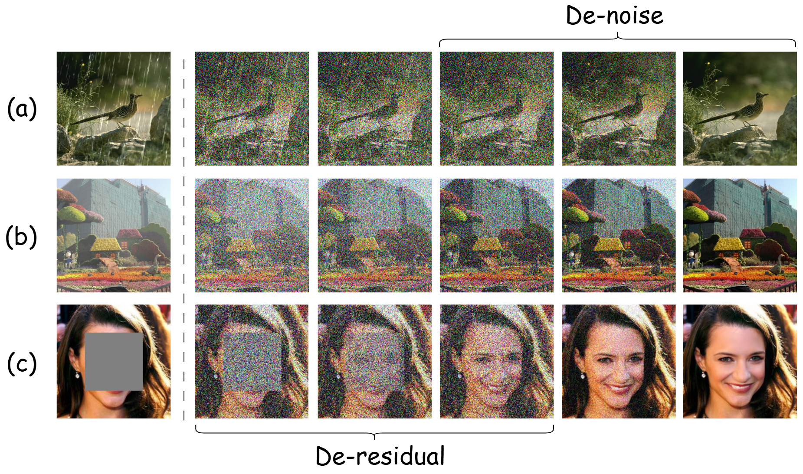

# CVPR2026: Decoupled Residual Denoising Diffusion Models for Unified and Data Efficient Image-to-Image Translation. 


We propose Decoupled Residual Denoising Diffusion models **(DRDD)** for unified and data-efficient image-to-image (I2I) translation. 

<details open>
<summary><b>Main Figure:</b></summary>



</details>


## Table of Contents
- [1.Prerequisites](#1prerequisites)
- [2.Installation](#2installation)
- [3.Downloading](#3downloading)
- [4.Experiments](#4experiments)
- [5.License](#5license)

## 1.Prerequisites

- Linux operating system
- NVIDIA GPU with CUDA capability
- Conda package manager
- Python 3.7+


## 2.Installation

```
git clone git@github.com:HKU-HealthAI/DRDD.git
cd DRDD DRDD-code
conda env create -f install.yaml
conda activate drdd
```

## 3.Downloading
### Step1: Download Models
First, download the models in the ./pretrained_models 
Quark: https://pan.quark.cn/s/8d7316f9684e 提取码：iXth
Google: 

### Step2: Download Datasets
Then, download the training and testing datasets.

## 4.Experiments 
### Training
```
cd DRDD DRDD-code

```
### Testing

### Evaluation


## Acknowledgements
This repo is based on [RDDM](https://github.com/nachifur/RDDM), [DiffUIR](https://github.com/iSEE-Laboratory/DiffUIR), and [guided-diffusion
](https://github.com/openai/guided-diffusion), thanks to the original authors for their works!

